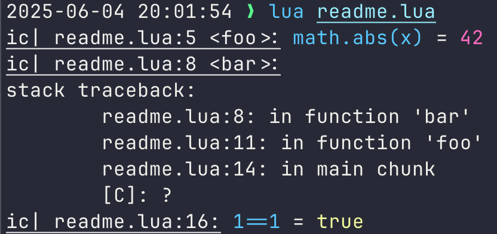

[](https://github.com/pre-commit/pre-commit)
[](https://github.com/jeffzi/icecream.lua/actions/workflows/busted.yml)
[](https://github.com/jeffzi/icecream.lua/actions/workflows/luacheck.yml)
[](https://luarocks.org/modules/jeffzi/icecream)

# icecream.lua

`icecream.lua` is a port of the debugging utility [IceCream](https://github.com/gruns/icecream).
It enhances print debugging by providing more informative and visually appealing output for Lua applications.
Say goodbye to traditional print statements and embrace a better way to debug your code.

Use `ic()` just like you would use `print()` for debugging:

```lua
local ic = require("icecream")

local foo = function()
   local x = 42
   ic("bar", x, math.abs(-9), {
      greetings = "hello",
      __call = function(self)
         print(self.greetings)
      end,
   })
end

foo()
```

Output:


## Installation

### [LuaRocks](https://luarocks.org/)

```shell
luarocks install luamark
```

### Manual Installation

`icecream.lua` is a single file that can be easily integrated into your project.
Simply download icecream.lua and include it in your project directory.

Ensure that optional dependencies are also available if you want extra features:

- **[dumbParser](https://github.com/ReFreezed/DumbLuaParser/blob/master/dumbParser.lua):** introspecting expressions and variable names (e.g: `ic| x = 42`)
- **[ansicolors](https://github.com/kikito/ansicolors.lua):** Enabling colored output.
- **[inspect](https://github.com/kikito/inspect.lua):** Pretty-printing tables.
- **[luasystem](https://github.com/lunarmodules/luasystem):** Terminal width detection and consistent environment variable reading on Windows.

## Usage

1. **Import IceCream:**

   ```lua
   local ic = require("icecream")
   ```

The result of `require` must be assigned to a variable named `ic` for maximum robustness when introspecting.

2. **Debugging with `ic()`:**

   Use `ic()` just like you would use `print()` for debugging:

   ```lua
    local ic = require("icecream")

    local foo = function()
       local x = -42
       ic(math.abs(x))
    end

    foo()
    -- Output: ic| readme.lua:5 <foo>: math.abs(x) = 42
   ```



3. **Output format**:

- **Inspection:** `ic()` inspects itself and prints both its own arguments and the values of those arguments. Each argument is pretty-printed, [`inspect`](https://github.com/kikito/inspect.lua) is required to pretty-print tables.

- **Context**: By default, each output is prefixed with the file, line number and function where `ic` was called.

- **Color:** The output is highlighted if [`ansicolors`](https://github.com/kikito/ansicolors.lua) is installed .

- **Multi-lines:**: The output is automatically wrapped over multiple lines as needed.

- **Stack traceback:** Without arguments, `ic()` will print a stack traceback.

```lua
local ic = require("icecream")

local function foo()
   ic()
end

foo()
-- Output:
-- ic| readme.lua:4 <foo>:
-- stack traceback:
-- 	    readme.lua:4: in function 'foo'
-- 	    readme.lua:7: in main chunk
-- 	    [C]: ?
```

IceCream has additional support for [`StackTracePlus`](https://github.com/ignacio/StackTracePlus).
With StackTracePlus installed, the previous snippet will output:

```
ic| readme.lua:4 <foo>
Stack Traceback
===============
(3) Lua local 'foo' at file 'readme.lua:4'
	Local variables:
	 x = number: 1
	 y = number: 2
(4) main chunk of file 'readme.lua' at line 7
(5)  C function 'function: 0x600001aec0c0'
```

## Returning the arguments

`ic()` returns its argument(s), so it can easily be inserted into pre-existing code.

```lua
local ic = require("icecream")

local x, y = ic(1, 2)
assert(x == 1)
assert(y == 2)

local t = { "hello" }
assert(t == ic(t))
```

## Customization

IceCream allows customization of its output behavior through configuration options:

```lua
ic.color = false                     -- Disable colorized output.
ic.max_width = 100                   -- Wrap text to new lines if longer than 100 characters.
ic.indent = "    "                   -- Indent with 4 spaces.
ic.prefix = "DEBUG"                  -- Change the prefix from 'ic|' to 'DEBUG'.
ic.include_context = false           -- Disable file name, line number, and function name output.
ic.traceback = function() end        -- Custom traceback function (can be nil), defaults to debug.traceback.
ic.output_function = function() end  -- Custom output function, e.g., write to a file.
```

## Dynamic Enabling/Disabling

You can enable or disable the printing of debugging output dynamically using `ic.enable()` and `ic.disable()`.
Debugging output can also be permanently disabled by setting the environment variable `NO_ICECREAM`.

## Environment Variables

- [`NO_COLOR`](https://no-color.org/): When present and not an empty string, prevents the addition of ANSI color.
- `NO_ICECREAM`: When present and not an empty string, permanently disables `ic` outputs even if `ic.enable()` is called.

## ic:format()

`ic:format()` is the same as calling `ic()` but returns a string rather than printing the output.

## Limitations

IceCream relies on `debug.getinfo`, which provides partial information about function calls.
This results in certain limitations on what IceCream can achieve:

- **Naming Convention:** The result of `require` must be assigned to a variable named `ic` for maximum robustness.
  While not mandatory, nested calls might not be properly detected otherwise.

  ```lua
  local dbg = require("icecream")

  dbg.include_context = false
  -- ic| { hello = "world" }
  dbg({ hello = "world" })
  -- ic| dbg({hello="world"}) = { hello = "world" }
  tostring(dbg({ hello = "world" }))
  ```

- **Single Call Limitation:** Only one call to `ic:format()` or `ic()` is supported per line of code.

  ```lua
    local ic = require("icecream")

    assert(ic(1) == ic(2, 3))-- Error: Failed to parse arguments from source

  ```

- **Return Value Restriction:** In _Lua 5.1_, `ic:format()` or `ic()` cannot be directly used as return values from functions.

  ```lua
  local ic = require("icecream")

  local function greetings(name)
     return ic("hello", name)
  end
  local hello, name = greetings("Jeff")  -- Error: Cannot use IceCream as a return value
  ```

## License

`icecream.lua` is licensed under the MIT License. See [LICENSE](LICENSE) for more information.

## Acknowledgments

This Lua port is based on the original IceCream Python library by [Grun](https://github.com/gruns/icecream).
